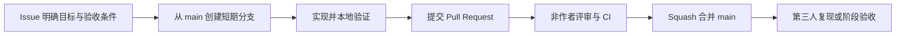

# 业务逻辑智能问询系统团队协作规范

## 1 目的与适用范围

本规范适用于“基于代码知识图谱与大模型的业务逻辑智能问询系统”项目的代码、部署配置、技术文档和实验材料。目标是让三名成员的工作可追踪、可复现、可评审，并避免密钥、业务源码和实验数据泄露。

本规范以仓库 `B-qwert/llm-agent-demo` 为唯一代码协作入口。任务计划和个人工作量以《三人任务分工进度计划_详细分工.xlsx》为准；本规范规定工作如何提交、评审和验收。

## 2 角色与职责

| 角色 | 本阶段职责 | 交付要求 |
| --- | --- | --- |
| 白乐刚 | 仓库维护、CI、集成、环境与发布协调 | 维护 main 可用；组织阶段验收；处理合并冲突和版本标签 |
| 夏高婷 | 图数据库、代码知识图谱、检索链路复核 | 复核 Neo4j、图谱 Schema、图查询和调用链结果 |
| 周笑彤 | 向量检索、LLM 接口、问答链路复核 | 复核 Milvus、模型接口、Prompt 和回答引用结果 |
| 全体成员 | 需求澄清、代码评审、联调、验收与问题记录 | 每项变更至少有一名非作者评审；阶段成果由第三人复现 |

以上职责用于明确协作接口，不替代任务计划中的共同负责安排。

## 3 工作流程



### 3.1 Issue

开始工作前创建 Issue，写明目标、负责人、依赖、验收条件和计划完成时间。一个 Issue 只解决一个可独立验收的问题。发现阻塞时当天更新 Issue，说明原因、影响和下一步。

### 3.2 分支

`main` 只保存可复现、可部署的版本。每项工作从最新 `main` 创建短期分支，名称采用以下格式：

| 类型 | 示例 | 使用场景 |
| --- | --- | --- |
| `feat/` | `feat/code-parser` | 新功能 |
| `fix/` | `fix/milvus-timeout` | 缺陷修复 |
| `docs/` | `docs/evaluation-plan` | 文档更新 |
| `test/` | `test/graph-query` | 测试补充 |
| `chore/` | `chore/dependency-update` | 工具、依赖或维护工作 |

禁止直接向 `main` 推送，禁止对共享分支执行 force push。分支完成并合并后应删除远程分支。

### 3.3 提交

提交信息格式为：`类型(范围): 简短说明`。例如：

```text
feat(neo4j): add call graph import command
fix(llm): redact provider errors in connectivity report
docs(eval): define answer traceability criteria
```

每次提交应能独立说明目的。不要混合无关重构、格式化、功能修改和密钥配置；格式化范围较大时应单独提交。

### 3.4 Pull Request 与评审

每个 Pull Request 必须关联 Issue，并说明：变更目的、主要实现、验证结果、数据或配置影响、未覆盖风险和回退方式。作者不得批准自己的 PR；至少一名非作者批准后才能合并。

评审者重点核对：

- 变更是否满足 Issue 的验收条件；
- 图谱事实是否能回溯到源码；
- 向量维度、集合名和 `symbol_id` 契约是否一致；
- LLM 输出是否携带可核对的代码引用；
- 是否出现密钥、业务源码、个人信息或大体积生成文件；
- 测试是否覆盖实际改动。

采用 squash 合并，合并提交的标题沿用 PR 标题。紧急修复可先处理故障，但应在 24 小时内补齐 Issue、测试和评审。

## 4 质量门禁

提交前至少运行：

```powershell
python -m unittest discover -s tests -v
docker compose config --quiet
```

修改 Neo4j、Milvus、Docker Compose 或环境脚本时，还应运行：

```powershell
powershell -File scripts/dev.ps1 up
```

修改 LLM 接口时，先运行离线测试；有 API 额度的成员再执行真实连通性检查。真实调用会消耗额度，测试不得发送未授权业务源码、用户数据或密钥。

GitHub Actions 中的 `offline` 和 `databases` 检查通过，才视为持续集成验证完成。数据库和模型验收报告放在 `reports/`，不提交到仓库。

## 5 配置与数据安全

- `.env` 只保存在本机，绝不提交、粘贴到 Issue 或写入日志。
- API 密钥、数据库密码和访问令牌通过环境变量或本地 `.env` 提供。
- 提交前执行 `git status` 和 `git diff --cached`，确认没有密钥、数据库卷、模型文件或未授权代码。
- 业务源码、脱敏前日志和实验标注集默认按内部资料处理；对外发布前由全体成员确认范围。
- 发现密钥已进入 Git 历史时，立即停止推送、撤销密钥并通知全体成员，由仓库维护者执行历史清理与重新发布。

## 6 沟通与节奏

每日在负责 Issue 更新进度、阻塞和下一步。每周进行一次短会，检查计划偏差、跨模块接口和验收证据。阶段结束前，由未参与实现的第三人从干净环境复现启动、核心查询和验收脚本。

发生接口调整时，先记录在 Issue，再同步更新 Schema、接口文档、示例和测试。影响其他成员的变更不得只在聊天中口头说明。

## 7 GitHub 平台配置

仓库当前为私有仓库。GitHub Free 不支持为私有仓库启用分支保护或 rulesets，因此现阶段以本规范的人工作流执行“PR、非作者评审、CI 通过后合并”的要求。

升级 GitHub Pro 后，应对 `main` 启用以下规则：

- 必须通过 `offline` 和 `databases` 两项检查；
- 至少一位非作者审批，新增提交后原审批失效；
- 要求解决全部 PR 对话；
- 禁止 force push 和删除分支；
- 启用线性历史。

仓库维护者收到夏高婷、周笑彤的 GitHub 用户名后，邀请其为协作者，并在邀请接受后进行一次分支、PR 和评审流程演练。

## 8 验收与修订

每个阶段完成时，验收材料至少包含：关联 Issue、PR、CI 结果、运行或实验报告和第三人复现记录。未通过验收的任务不得在进度表中标记为完成。

本规范由全体成员共同维护。涉及职责、分支策略、安全要求或验收标准的修改，须经至少两人确认并通过 PR 合并。
