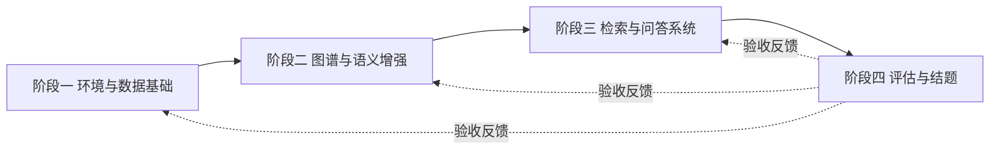
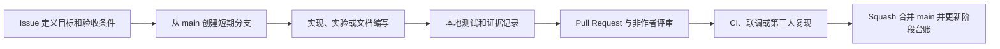

# 业务逻辑智能问询系统全周期团队协作规范

## 1 目的与适用范围

本规范适用于“基于代码知识图谱与大模型的业务逻辑智能问询系统”从环境搭建到结题归档的全部阶段，覆盖代码、部署配置、知识图谱、向量索引、模型调用、评测集、技术文档、演示材料和软件著作权材料。

项目以仓库 `B-qwert/llm-agent-demo` 为唯一代码协作入口。任务起止时间、工作量和人员安排以《三人任务分工进度计划_详细分工.xlsx》为准；本规范用于统一协作流程、质量要求和交接方式。

## 2 技术基线与基础编码规范

所有成员以本仓库的配置文件为准，未经 Issue 讨论和 PR 审核不得自行变更下列基础版本、服务地址或协议。

| 类别 | 当前统一选型 | 版本或约定 | 使用要求 |
| --- | --- | --- | --- |
| 操作系统与容器 | Windows 10/11、Docker Desktop、WSL 2、Linux containers | Docker Desktop 使用 WSL 2 后端 | 启动 Docker Desktop 后在项目根目录执行命令；建议为 Docker 分配至少 4 核 CPU、8 GB 内存和 20 GB 磁盘。 |
| 主开发语言 | Python | 容器运行时固定为 Python 3.12.12；本机推荐 Python 3.12 | 业务模块、数据处理、图谱/向量/LLM 客户端统一使用 Python；依赖写入 `requirements.txt` 并固定版本。 |
| 命令脚本 | PowerShell | Windows PowerShell 或 PowerShell 7 | 环境和容器操作统一通过 `scripts/dev.ps1`；脚本文件保留 CRLF 换行。 |
| 图数据库 | Neo4j Community | Docker 镜像 `neo4j:5.26.12`；驱动 `neo4j==5.28.2` | Browser 使用 `http://localhost:7474`，Bolt 使用 `bolt://127.0.0.1:7687`；仅绑定本机回环地址。 |
| 向量数据库 | Milvus Standalone | Docker 镜像 `milvusdb/milvus:v2.6.21`；客户端 `pymilvus==2.6.6` | 客户端使用 `http://127.0.0.1:19530`；健康检查端口为 `9091`；不得修改为公网暴露。 |
| Milvus 依赖 | etcd、MinIO | `etcd:v3.5.25`、MinIO `RELEASE.2024-05-28T17-19-04Z` | 仅在 Docker Compose 内部网络使用，不新增主机端口映射。 |
| 大模型服务 | DeepSeek OpenAI 兼容 Chat Completions API | 基础地址 `https://api.deepseek.com`；模型 `deepseek-v4-flash` | 基础地址不追加 `/chat/completions`；密钥只放在本机 `.env`；连通性测试使用 `LLM_THINKING=disabled`。 |
| 编排与配置 | Docker Compose、YAML、环境变量 | `compose.yaml`、`.env.example` | Compose 文件使用 2 空格缩进；服务镜像使用明确版本标签，不使用 `latest`。 |

### 2.1 本地初始化和统一命令

首次进入项目时，先生成本机 `.env`，再启动服务：

```powershell
python scripts/init_env.py
powershell -File scripts/dev.ps1 up
```

| 目的 | 命令 |
| --- | --- |
| 初始化本地环境变量 | `powershell -File scripts/dev.ps1 init` |
| 启动服务并验证数据库 | `powershell -File scripts/dev.ps1 up` |
| 执行 Neo4j、Milvus、LLM 全链路检查 | `powershell -File scripts/dev.ps1 check` |
| 仅测试 DeepSeek 连通性 | `powershell -File scripts/dev.ps1 llm` |
| 查看服务状态 | `powershell -File scripts/dev.ps1 status` |
| 停止服务且保留数据 | `powershell -File scripts/dev.ps1 stop` |

`docker compose down -v` 会删除 Neo4j、Milvus、etcd、MinIO 的命名卷。除非获得数据负责人确认，不得执行该命令。

### 2.2 代码、文件与依赖规范

- Python 文件采用 UTF-8、LF 换行、4 个空格缩进、每个文件末尾保留一个换行；YAML 采用 2 个空格缩进；PowerShell 脚本采用 CRLF 换行。具体规则以 `.editorconfig` 和 `.gitattributes` 为准。
- 模块、函数、变量使用英文 `snake_case`；类使用 `PascalCase`；常量使用全大写 `UPPER_SNAKE_CASE`。面向用户的说明、README 和报告可使用中文。
- 新增 Python 依赖必须在 `requirements.txt` 中以 `包名==版本号` 固定版本，并在 PR 说明用途、兼容性和验证结果；不得提交本机虚拟环境、缓存目录或未锁定的依赖清单。
- 配置读取必须使用环境变量或 `.env`，不得在 Python、Compose、测试和文档示例中硬编码密码、API Key、Token 或真实业务数据。
- 代码变更应包含必要的单元测试；连通性、检索和评测结果输出到本地 `reports/`，提交前只提交脱敏后的结论性报告或可复现脚本。
- 数据库 Schema、Milvus collection、向量维度、索引参数、Prompt 模板和 API 请求/响应字段均属于跨模块契约。修改前须在 Issue 说明版本、兼容性、迁移与回退方式。

### 2.3 服务数据与接口约定

- Neo4j 默认数据库为 `neo4j`。图谱节点、关系、约束和索引的创建必须脚本化；测试写入使用可识别的测试标签，并在测试完成后回滚或删除。
- Milvus 的 collection 命名使用小写英文和下划线，例如 `code_chunks_v1`；每条向量须包含稳定的 `symbol_id` 或等价源码定位字段。向量维度和 Embedding 模型一经确定，变更 collection 或维度时必须建立新版本，不得直接混写。
- LLM 调用统一复用 `bizcodeqa/llm.py` 的 OpenAI 兼容客户端。请求必须设置超时；生产或演示调用需要记录模型名、参数版本和脱敏后的错误类型，不能记录密钥和完整敏感提示词。
- 本地端口仅供本机开发：Neo4j `7474/7687`，Milvus `19530/9091`。如需团队共享或部署到服务器，须另行增加认证、TLS、访问控制与备份方案，不能直接开放当前开发环境端口。

## 3 全周期阶段与共同目标

| 阶段 | 时间 | 核心成果 | 阶段完成标准 |
| --- | --- | --- | --- |
| 阶段一：环境与数据基础 | 2026 年 9–10 月 | 开发环境、代码解析器、统一 Schema、图谱初版 | 环境可复现；解析结果可定位源码；图谱和向量存储可用 |
| 阶段二：知识图谱与语义增强 | 2026 年 11 月–2027 年 2 月 | 业务实体关系、语义卡片、增量更新机制 | 图谱关系正确；语义标注可追溯；增量链路通过回归测试 |
| 阶段三：检索与问答系统 | 2027 年 3–4 月 | 混合检索、引用生成、Web 演示页面 | 检索链路可解释；回答附引用；系统联调完成 |
| 阶段四：评估与结题 | 2027 年 5 月 | 评测集、评估报告、结题报告、演示视频和归档包 | 指标有证据；材料版本一致；成果可复现和可交付 |



每个阶段均遵循“任务明确 → 实现或实验 → 同行评审 → 联调或复现 → 验收归档”的闭环。阶段成果未经验收不得作为下一阶段的稳定输入。

## 4 角色与职责

| 角色 | 主要负责方向 | 跨阶段职责 |
| --- | --- | --- |
| 白乐刚 | 项目集成、仓库维护、代码解析、图谱构建与阶段协调 | 维护可用主线；管理版本、CI 和部署；组织验收、结题归档与成果一致性检查 |
| 夏高婷 | 图数据库、代码知识图谱、业务语义、图检索与可视化 | 维护实体关系 Schema；复核图查询、调用链、语义关系和图谱展示准确性 |
| 周笑彤 | 向量数据库、LLM 接口、混合检索、问答与前端页面 | 维护向量集合和模型接口；复核召回、Prompt、回答引用和交互结果 |
| 全体成员 | 需求澄清、评审、联调、评测和成果确认 | 每个变更有实施者与非作者评审者；每个阶段由第三人完成独立复现 |

职责用于明确接口和复核路径，不替代进度计划中的共同负责任务。实际任务变更须同步更新 Issue、计划表和本规范中对应的交接信息。

## 5 通用协作流程



### 4.1 Issue

开始工作前创建 Issue，写明目标、负责人、输入依赖、输出成果、验收条件、计划完成时间和风险。一个 Issue 只解决一个可独立验收的问题。阻塞超过一个工作日时，当天记录原因、影响范围和需要协助的事项。

涉及跨模块接口、实体关系 Schema、向量维度、Prompt 协议、评测指标或文档结论的变更，必须先在 Issue 说明兼容性和迁移方式，再开始修改。

### 4.2 分支与提交

`main` 只保存可复现、可部署、可评测的版本。每项工作从最新 `main` 创建短期分支：

| 类型 | 示例 | 使用场景 |
| --- | --- | --- |
| `feat/` | `feat/incremental-index` | 功能或研究能力 |
| `fix/` | `fix/citation-validator` | 缺陷修复 |
| `experiment/` | `experiment/retrieval-ranking` | 可重复实验 |
| `docs/` | `docs/final-report-outline` | 文档和材料 |
| `test/` | `test/call-graph-regression` | 测试和评测 |
| `chore/` | `chore/dependency-update` | 依赖和维护 |

提交信息采用 `类型(范围): 简短说明`，例如 `feat(neo4j): import call graph relations`。禁止直接向 `main` 推送，禁止对共享分支 force push，禁止将无关重构、格式化和功能修改混在同一提交中。

### 4.3 Pull Request 与评审

每个 Pull Request 必须关联 Issue，并说明变更目的、实现要点、验证结果、数据或配置影响、已知限制和回退方式。作者不得批准自己的 PR；至少一名非作者批准后才能合并。采用 squash 合并，合并提交标题沿用 PR 标题。

评审者应根据变更类型核对：

- 解析、图谱：实体和关系是否可回溯至源代码，Schema 是否兼容；
- 向量、检索：向量维度、集合名、`symbol_id`、过滤条件和排序是否一致；
- LLM、问答：Prompt、工具调用和答案是否附有可核对引用，是否发生结构性幻觉；
- 前端、演示：核心路径是否可操作，引用和错误状态是否清晰；
- 评测、文档：结论是否由可定位数据支持，指标和版本是否一致；
- 全部变更：是否有密钥、业务数据、个人信息或不应提交的大文件。

## 6 阶段协作与交接要求

### 6.1 阶段一：环境与数据基础

统一开发环境、目录结构、代码风格、依赖版本和配置模板。代码解析任务必须保留源文件路径、符号定位范围和解析器版本；图谱 Schema 的实体、属性、关系和约束须形成版本化文档。环境、Neo4j、Milvus 和 LLM 连通性通过后，生成验收报告作为阶段输入。

交接时提供：环境启动命令、配置项说明、解析样例、Schema 版本、建库脚本和已知限制。接收人必须在干净目录复现一次。

### 6.2 阶段二：知识图谱与语义增强

新增关系必须标明抽取来源、置信度或规则版本。LLM 生成的业务摘要、实体映射和状态机推断须与代码位置关联，并区分“确定事实”“模型推断”和“待人工确认”。增量更新需覆盖新增、修改、删除和重命名四类代码变更。

交接时提供：增量事件定义、数据迁移方案、基线图谱快照摘要、语义卡片样例、回归集和指标对比。任何 Schema 破坏性变更都需提供迁移脚本和回退方案。

### 6.3 阶段三：检索与问答系统

混合检索输出须保留查询版本、检索路由、候选来源、图扩展路径和最终引用。问答模块的每个结论应能对应图谱节点、代码片段或文档证据。前端不展示内部密钥、完整业务数据或无脱敏日志。

交接时提供：接口契约、Prompt 版本、Embedding 模型与向量维度、评测样例、错误码说明和演示脚本。系统联调后，由第三人完成“提问—检索—引用—回答”的端到端复现。

### 6.4 阶段四：评估与结题

评测集问题、标准答案、证据位置、评分规则和评测脚本必须版本化。每次指标结果记录代码提交、模型名称、参数、数据集版本、运行时间和随机种子。不得以一次偶然运行替代稳定结论，也不得只报告有利样本。

结题报告、软件著作权材料、演示视频和答辩材料须从同一版本清单生成。结题前由全体成员核对名称、指标、截图、代码版本和演示行为一致，并建立只读归档包。

## 7 质量门禁

所有提交前至少运行：

```powershell
python -m unittest discover -s tests -v
docker compose config --quiet
```

修改 Neo4j、Milvus、Docker Compose、解析器或环境脚本时，额外运行：

```powershell
powershell -File scripts/dev.ps1 up
```

修改检索、问答或 LLM 接口时，先运行离线测试；有额度的成员再执行真实调用。修改评测逻辑时，必须记录与基线的差异。GitHub Actions 的 `offline` 和 `databases` 检查通过，才视为基础持续集成验证完成。

## 8 配置、数据与实验安全

- `.env`、API 密钥、数据库密码和访问令牌只保存在本机，绝不提交、粘贴到 Issue 或写入日志。
- 业务源码、脱敏前日志、标注集和截图默认按内部资料处理；对外发布范围须由全体成员确认。
- 实验输出进入 `reports/` 或专用数据目录；每份可复现报告记录生成脚本、输入版本和时间。
- 发现密钥进入 Git 历史时，立即停止推送、撤销密钥、通知全体成员，并由仓库维护者清理历史后重新发布。
- 模型调用不得发送未经授权的业务源码、用户数据或第三方受限材料。

## 9 沟通与阶段例会

每日在负责 Issue 更新进度、阻塞和下一步。每周短会检查计划偏差、接口变更、质量风险和跨模块依赖。阶段末召开验收会，展示可运行成果、报告失败项、确认交接清单并决定下一阶段入口版本。

需要即时决策的问题可在群聊讨论，但最终结论必须回写 Issue、PR 或决策记录。影响其他模块的变更不得只以口头或聊天消息通知。

## 10 GitHub 平台配置

仓库当前为私有仓库。GitHub Free 不支持为私有仓库启用分支保护或 rulesets，因此现阶段以本规范的人工作流执行“PR、非作者评审、CI 通过后合并”的要求。

升级 GitHub Pro 后，应对 `main` 启用：`offline` 与 `databases` 必需检查、至少一位审批、新提交后审批失效、解决全部 PR 对话、禁止 force push、禁止删除分支和线性历史。仓库维护者收到其他成员的 GitHub 用户名后，应发送协作者邀请并组织一次分支、PR 和评审流程演练。

## 11 修订与验收

本规范由全体成员共同维护。涉及职责、阶段交接、分支策略、安全要求、实验标准或验收标准的修改，须经至少两人确认并通过 PR 合并。

每个阶段的归档包至少包含：任务清单、关联 Issue 和 PR、CI 结果、环境或实验报告、接口和 Schema 版本、第三人复现记录以及已知问题。未通过验收的任务不得在进度表中标记为完成。
